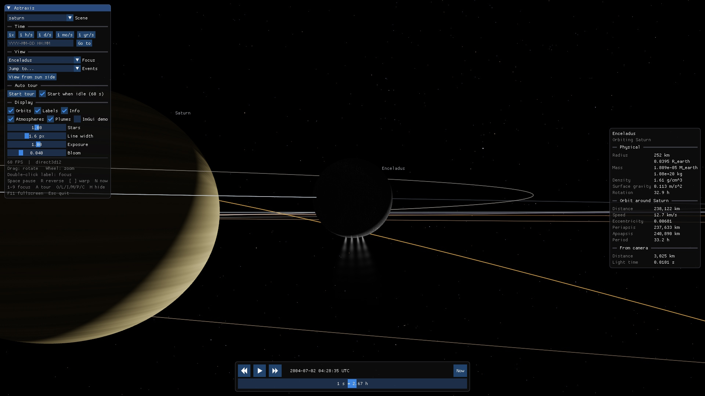

<br />
<div align="center">
  
  <h3 align="center">Astraxis</h3>
  
  
</div>
<br />

Astraxis shows planets, spacecraft and stars in motion using orbital data and physical simulations. Run it in a window or full screen, or use it on Windows as a live wallpaper behind desktop icons or as a screensaver. Leave it running in the background when you want something to watch.

## Scenes

| Scene | What you see | Motion source |
|---|---|---|
| Solar System (default) | The Sun, planets, major moons, dwarf planets and largest asteroids | JPL Horizons ephemerides, JPL mean orbital elements, JPL Small-Body Database |
| Jupiter | Jupiter, its faint rings, the Galilean and four inner moons, and the orbits of Galileo (1995 to 2003) and Juno (2016 onward) | JPL Horizons ephemerides, JPL mean orbital elements |
| JWST | JWST's halo orbit around Sun-Earth L2 | JPL Horizons ephemerides |
| Earth-Moon | Artemis II's free-return flight, Artemis I's distant retrograde orbit and CAPSTONE's near-rectilinear halo orbit, in the Earth-Moon rotating frame | JPL Horizons ephemerides |
| Saturn | Saturn's rings (Cassini radio-occultation optical depths), the seven major moons, Cassini's tour and Huygens' descent to Titan | JPL Horizons ephemerides, JPL mean orbital elements (phases fitted to Horizons) |
| Mercury: MESSENGER & BepiColombo | Both spacecraft on their cruises to Mercury with Earth, Venus and Mercury gravity assists, MESSENGER's four years in orbit and impact, BepiColombo's capture (Nov 2026) and science orbit | JPL Horizons ephemerides |
| Rosetta & 67P | Earth, Mars and two more Earth gravity assists, the asteroids Steins and Lutetia, then two years at comet 67P: the arrival triangles, Philae's release, the flybys, perihelion and the descent to the surface, on the OSIRIS shape models | JPL Horizons ephemerides; ESA/OSIRIS shape models (PDS) |
| ISEE-3 / ICE | The first halo orbit around Sun-Earth L1 (1978-1982), the geotail passes and five lunar flybys of 1983, the first comet flyby (Giacobini-Zinner, 1985), the pass between the Sun and Halley (1986), and 28 years around the Sun back to the Earth and Moon (2014) | Reconstructed from NASA SSCWeb positions and the JPL navigation trajectory (PDS); JPL Horizons for 2014 |
| Parker Solar Probe | Seven Venus gravity assists lower the perihelion to 9.86 solar radii. The trajectory forms petals in the Sun-Venus rotating frame | JPL Horizons ephemerides |
| Alpha Centauri | A, B and Proxima | Newtonian N-body integration |
| Sgr A* | The Galactic Centre black hole and the star S2 | Kerr geodesics + GPU ray-traced black hole |
| TRAPPIST-1 | Seven Earth-sized planets in a resonant chain around an ultracool dwarf | Newtonian N-body integration from transit-timing fits |
| Kepler-223 | Four sub-Neptunes in a 3:4:6:8 resonant chain | Newtonian N-body integration from transit-timing fits |
| Kepler-47 | Three planets orbiting an eclipsing binary: a Sun-like star and a red dwarf | Newtonian N-body integration from a photodynamical fit |
| Kepler-64 / PH1 | A Neptune-sized planet orbiting an eclipsing binary, with another pair of stars about 1,300 au away | Newtonian N-body integration for the inner binary and planet; assumed Keplerian orbits for the distant pair |
| TIC 168789840 | Six stars in three eclipsing binaries. Two pairs orbit each other, with the third pair about 250 au away | Nested Keplerian orbits from eclipse observations, with an assumed outer orbit |
| PSR B1620-26 | A pulsar, a white dwarf and a planet in the globular cluster M4 | Nested Keplerian orbits from pulsar timing |
| PSR B1913+16 (Hulse-Taylor) | Two neutron stars on a 7.75-hour orbit whose periastron has turned about 220° since its discovery in 1974. Grey ellipses show the orbit Newtonian gravity predicts from 1974 | Relativistic pulsar-timing orbit (periastron advance, orbital decay) |
| PSR J1141-6545 | A young pulsar and a massive white dwarf on a 4.7-hour orbit. The periastron advances 5.3° a year; grey ellipses show the Newtonian orbit from 1999 | Relativistic pulsar-timing orbit (periastron advance, orbital decay) |

Add scenes by writing TOML files in `assets/scenes/`. The scene files cite sources for physical constants and orbital elements. Each `assets/*/SOURCES.md` lists the data licenses.

## Preview

<a href="screenshots/demo_saturn.jpg">
    
</a>

## Building

CMake downloads pinned versions of SDL3, glm, Dear ImGui, toml++, stb_image and Microsoft's DirectX Shader Compiler. The shader compiler builds HLSL shaders as DXIL and SPIR-V.

### Windows (Direct3D 12)

Use Visual Studio 2026 with its bundled CMake.

```bash
cmake --preset win-msvc
cmake --build --preset win-msvc-debug
```

Run the app with `build/win-msvc/Debug/astraxis.exe` and the unit tests with `build/win-msvc/Debug/astraxis_tests.exe`. The build also places `astraxis.scr` (the screensaver) and `astraxis_wallpaper.exe` (the wallpaper launcher and settings dialog) next to `astraxis.exe`.

Windows MSVC builds use [VC-LTL5 v5.3.1](https://github.com/Chuyu-Team/VC-LTL5/tree/v5.3.1) by default for non-Debug configurations. VC-LTL uses the Windows 10 system `ucrtbase.dll` to reduce the runtime footprint. CMake downloads the pinned binary package and checks its SHA-256. To build the CI Release configuration locally:

```bash
cmake --preset win-msvc -B build/win-vcltl -DASTRAXIS_USE_VC_LTL=ON -DCMAKE_MSVC_RUNTIME_LIBRARY=MultiThreaded
cmake --build build/win-vcltl --config Release
ctest --test-dir build/win-vcltl -C Release --output-on-failure
```

`ASTRAXIS_USE_VC_LTL` defaults to `ON` for Windows MSVC and `OFF` elsewhere. Debug builds use the standard CRT with Debug heap support, even when the option is `ON`. Set `-DASTRAXIS_USE_VC_LTL=OFF` to disable VC-LTL for non-Debug builds too.

Existing CMake build directories keep their cached setting. To enable VC-LTL in an existing build directory, pass `-DASTRAXIS_USE_VC_LTL=ON`. VC-LTL requires Windows and MSVC. The app still requires a Windows version that supports its graphics backend.

### Linux x64 (Vulkan)

Use GCC or Clang with C++20 support, CMake 3.28 or later, Ninja and the X11/Wayland development headers required by SDL3. On Ubuntu:

```bash
sudo apt install ninja-build libx11-dev libxext-dev libxrandr-dev libxcursor-dev libxi-dev libxss-dev libxtst-dev libxfixes-dev libxkbcommon-dev libwayland-dev libdecor-0-dev libdrm-dev libgbm-dev libegl-dev
cmake --preset linux
cmake --build --preset linux-release
```

Run the app with `build/linux/Release/astraxis` and the unit tests with `build/linux/Release/astraxis_tests`. The app needs a Vulkan driver.

The Windows build includes SPIR-V shaders too. Set `SDL_GPU_DRIVER=vulkan` to run it on Vulkan.

## Command line

```bash
astraxis --scene sgr_a --event 1
```

| Option | Meaning |
|---|---|
| `--scene <name>` | A file from `assets/scenes/`, without `.toml` (default: `solar_system`) |
| `--event <n>` | Start at an entry of the scene's Events list, numbered from 1 |
| `--mode <mode>` | `window` (default), `fullscreen`, `screensaver` or `wallpaper` (Windows) |
| `--display <n>` | The display to use, numbered from 1 |
| `--fps <n>` | Frame rate cap (0: the display's refresh rate) |
| `--config <path>` | Use a settings file other than `config.toml` |

Command-line options override settings for the current run. The settings file keeps its saved values.

## Settings

Astraxis stores settings in `config.toml` next to the executable. Copy this folder to take your settings with you. When the app window closes, it saves changes made in its panel: the scene, display, full-screen mode, visible elements and image adjustments. Wallpaper and screensaver settings use separate sections in the same file, edited through their settings dialogs. Display options without a separate setting in those dialogs use the window's settings.

If the folder is read-only (for example under `Program Files`), nothing is saved.

## Wallpaper and screensaver (Windows)

Both run on Windows 10 and Windows 11.

### Live wallpaper

Run `astraxis_wallpaper.exe`, choose a scene and displays, and click Apply. The wallpaper tours the scene behind the desktop icons, one view per display. Use its notification-area icon to open settings, pause the wallpaper or stop it. Tick *Start with Windows* to start it when you sign in. The wallpaper resumes automatically after Explorer restarts or the display setup changes. Stopping it restores the Windows wallpaper.

### Screensaver

Right-click `astraxis.scr` and choose *Install*. Keep it next to `astraxis.exe` and the `assets` folder so it can find its data. Copying the `.scr` file alone to `System32` prevents it from finding those resources. *Settings* in the Screen Saver Settings dialog opens the screensaver's settings.

### Power use

The wallpaper pauses rendering while the session is locked or the display is off. It also pauses rendering on displays covered by a maximized or full-screen window. In both settings dialogs you can lower the rendering resolution, cap the frame rate, and choose what happens on battery or with the battery saver on: keep running, at most 30 FPS (the default), or pause.

## Controls

| Input | Action |
|---|---|
| Left/right drag | Rotate camera |
| Mouse wheel | Zoom |
| `1` to `9` | Focus on a body |
| `Space` | Pause / resume |
| `R` | Reverse time |
| `[` / `]` | Halve / double time warp |
| `N` | Jump to the current time |
| `A` | Toggle auto tour (starts by itself after 60 s idle) |
| `O` / `L` / `I` | Toggle orbits / labels / the focused body's info panel |
| `P` | Toggle the volcanic and cryovolcanic plumes (Io, Enceladus, Triton) |
| `M` | Toggle atmospheres |
| `C` | Toggle comet comae and tails |
| `H` / `F1` | Toggle UI |
| `F11` | Toggle full screen |
| `Esc` | Quit |

## License

Astraxis is licensed under the [GNU General Public License v3.0 or later](LICENSE) (GPL-3.0-or-later).

Third-party libraries and data have their own licenses. See [THIRD_PARTY_NOTICES.md](THIRD_PARTY_NOTICES.md).
